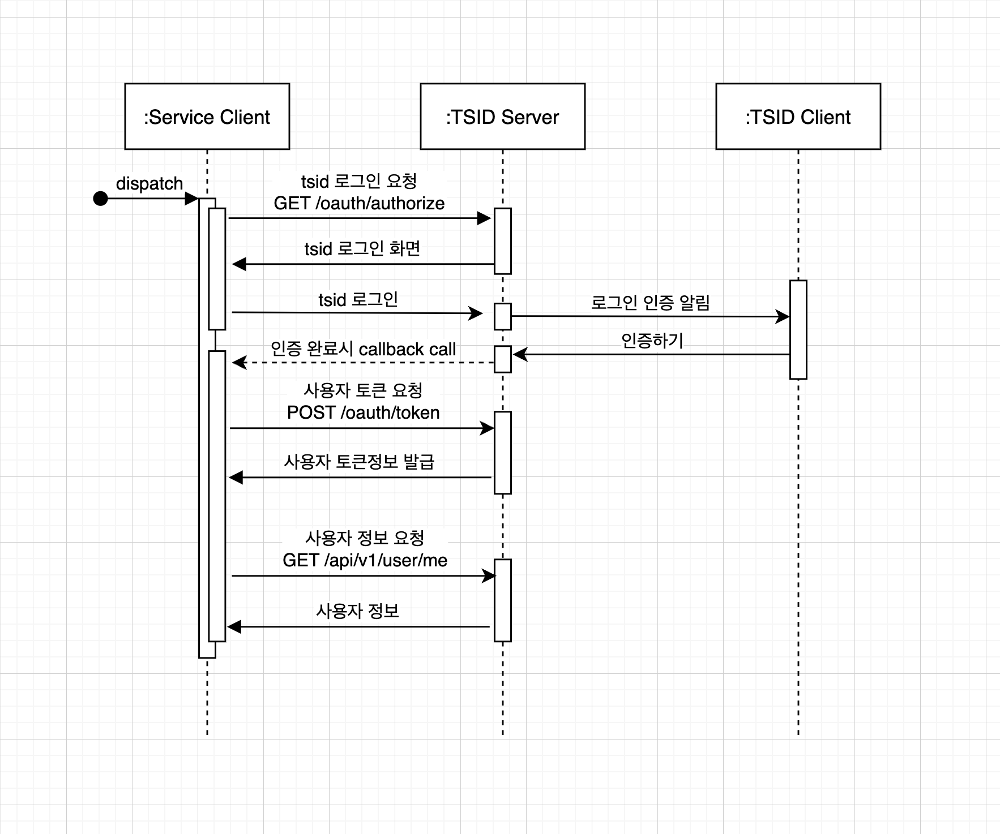

# tsid-auth
> TSID 인증/인가 서비스

사용처에서 TSID 인증및 인가를 받기위한 서비스  

운영중인 서비스를 위해 dto, request, response 는 제거  
암호화 과정, 토큰 생성, 데이터 생성 관련 코드 제거  
서비스 로직 필수부분 상당수 제거   
QueryDsl repo 절반 제거  

프로젝트 구조 및 흐름정도만 남겨놓음

 

> spring boot, spring security  
> jpa, querydsl, mysql 
> fcm push, naver sms, naver storage  

------------------------

### 서비스 이용 플로우
1. 사전 협의를 통해 사용처에 대한 정보를 등록
> 정보를 등록하면 client_id, secret_key 등 인증/인가를 위한 키 발급
2. 사용처에 대한 등록과 동시에, api 가이드를 안내
> 사용처에 대한 관리(사용처 정보, callback_uri 등..) 페이지에 대한 접속정보 전달
3. 인가/인증 에 관련된 api 테스트가 끝나면 운영 요청
4. 운영 서비스에서 사용

------------------------

## TSID 인가 프로세스

1. 발급받은 client_id와 등록한 redirect_uri를 통해 로그인 요청
2. http 302 code 를 통해 받은 화면을 띄워준다.(tsid 로그인 화면)
3. 사용자가 tsid 인증을 마치면 요청했던 redirect_uri로 callback 된다.
4. callback으로 받은 값을 통해 사용자 토큰 요청
5. 받은 토큰값을 통해 사용자 정보를 받아 로그인 완료 시킨다. 

------------------------

## TSID 인증 프로세스

1. 인증받을때 해당 서비스가 모바일 서비스라면 딥링크로, 모바일 이외의 서비스라면 푸시타입으로 인증요청.
2. 딥링크로 요청을 했다면 딥링크 정보가 날라와 바로 실행시키면 TSID 앱이 실행되며 바로 인증이 진행된다.
3. 푸시타입으로 요청을 했다면 사용자 TSID 앱으로 푸시가 날라가 알림을 주고, 인증을 진행하면 된다.
4. 해당 인증이 완료되면 요청했던 redirect_uri로 callback 을 보낸다.
5. 해당 인증에 대한 확인요청을 통해 인증 결과값을 확인한다.
6. 인증이 완료되어 다음 프로세스 진행.

